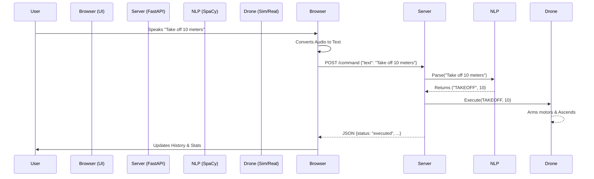

# 🏗️ System Architecture

This project uses a modular architecture to convert voice commands into drone telemetry actions completely offline (except for the browser's speech-to-text engine).

## 🧩 Components

### 1. Frontend (`speech.html`)
-   **Tech**: HTML5, Vanilla JS, CSS3 (Dashboard UI).
-   **Role**:
    -   Captures voice using the **Web Speech API**.
    -   Provides visual feedback (transcript, stats, history).
    -   Sends recognized text to the backend via REST API (`POST /command`).

### 2. Backend API (`server.py`)
-   **Tech**: Python, FastAPI, Uvicorn.
-   **Role**:
    -   Serves the frontend UI (`/`).
    -   Receives command text.
    -   Orchestrates the NLP parsing and Drone execution.
    -   Uses `run_in_threadpool` to prevent blocking the async loop during drone operations.

### 3. NLP Engine (`nlp_module.py`)
-   **Tech**: spaCy (`en_core_web_sm`).
-   **Role**:
    -   Parses natural language text.
    -   Extracts **Intent** (e.g., `TAKEOFF`, `MOVE_LEFT`).
    -   Extracts **Parameters** (e.g., `10` meters, `90` degrees).
    -   Handles logic priority (e.g., correctly distinguishing "Return to Launch" from "Takeoff").

### 4. Drone Controller (`drone_control.py`)
-   **Tech**: DroneKit, Pymavlink.
-   **Role**:
    -   Manages connection to the vehicle (SITL or hardware) via MAVLink.
    -   Executes specific flight commands (Velocity vectors, Mode changes).
    -   Handles safety checks (Arming check, Connection status).

## 🔄 Data Flow

